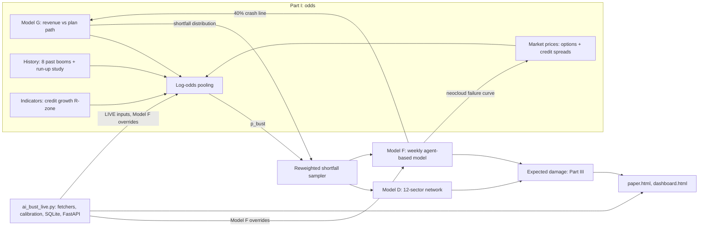

# Overview: the question, the three model families, and how the pieces connect

## The question

How likely is an AI investment bust over the next three years, and how much damage would it do? Two different events are tracked, because they are not the same thing:

- **Market crash.** Chip stocks (the PHLX Semiconductor index, SOX) fall 40% or more from a peak.
- **Economic bust.** End-customer AI spending falls 15% or more below the path the buildout was planned for (the *plan path*: revenue keeps pace with the AI capital stock).

The answer comes in three parts: **Part I** the odds, **Part II** the damage if it happens, **Part III** the two combined into expected damage, with an odds tracker.

## The three model families

| Family | Question | Technique | File |
|---|---|---|---|
| **Model G** and the pooled odds | How likely is a bust? | Four independent estimates (a revenue simulation, history, market prices, warning indicators) pooled by weighted log-odds | `ai_bust_probability.py` → [doc 03](03-part-I-odds-model-G.md) |
| **Model D** (with Models A, B, C, E) | If a bust happens, how does it spread? | 12-sector contagion network with funding, credit and legal-delay channels; Monte Carlo | `ai_bust_models.py` → [doc 02](02-models-A-to-E.md) |
| **Model F** | Same, at firm level, with behaviour and policy | Weekly agent-based simulation with nine switchable mechanisms | `ai_bust_abm.py` → [doc 04](04-model-F-agent-based.md) |

## How the files connect

Two links are circular by design and are flagged in the paper as sources of non-independence: the **credit-spread estimate** borrows Model F's neocloud failure curve and Model G's shortfall distribution, and **Model G's market-crash line** borrows Model F's 10–12.5% line.

## Files

| File | Role |
|---|---|
| `ai_bust_models.py` | Models A (revenue gap), B (depreciation), C (neocloud solvency), D (contagion), E (macro) and the 10,000-draw Monte Carlo |
| `ai_bust_abm.py` | Model F, the weekly agent-based model, its scenario runner, ablations, cliff sweep, knockout tests and Monte Carlo |
| `ai_bust_probability.py` | Part I (Model G, history, market, indicators, pooling, tracker, sensitivities) and Part III (expected damage); `--calibrate-mapping` |
| `ai_bust_live.py`, `dashboard.html`, `manual_inputs.json` | The live-data pipeline, API and dashboard |
| `run_abm_final.py` | Model F ablation, cliff and knockout runs that produce the `abm_final_*.json` files |
| `build_site.py` | Builds the paper as a web page from `working_paper.md` and the result files |
| `test_ai_bust_live.py` | Ten offline unit tests for the live pipeline |
| `probability_results.json` | The paper's published results (as of 2026-10-05) |
| `abm_final_*.json`, `abm_shock_to_realised.json` | Model F sweep results |
| `probability_results_rerun_20261006.json`, `backup_20261006/` | The 6 October 2026 reproduction run and the shipped originals it is compared with |
| `fixtures/` | The recorded snapshot of the paper's inputs |
| `docs/` | This specification, the paper (`paper.md`, `paper.html`) |

## Simulation register

Counts are from the result files and code constants. A Model F "scenario run" is a scenario plus its no-shock twin (plus an unconstrained run when the power ceiling is on).

| ID | Simulation | Kind | Size | Seeds | Output |
|---|---|---|---|---|---|
| S1 | Model G | Monte Carlo over uncertain inputs | 40,000 paths | 20261005 | `probability_results.json` |
| S2 | Pooling of the four methods | joint draws with random log-odds weights | 40,000 | 20261005 | same |
| S3 | Model G sensitivity | one-at-a-time tornado + 4 stress cases | 20,000 paths × 27 settings | 7 | `tornado_g` |
| S4 | Model G upgrade ladder | cumulative ladder and leave-one-out | 40,000 paths × 11 specifications | 7 | `g_upgrade_ablation` |
| S5 | Model D | sector network, with and without legal friction | 10,000 draws × 2 | 11 / 20260930 | `model_d`, `model_d_legal` |
| S6 | Model F, Part III | agent-based, shortfalls from Model G | 400 draws × 3 (v2, v1, alternative mapping) | 5 | `model_f`, `model_f_v1`, `model_f_by_shock` |
| S7 | Model F ablation | each of 9 mechanisms added/removed, 22 cases, shocks 10/20/30% | 1,584 scenario runs | 1000–1023 | `abm_final_ablation.json` |
| S8 | Model F cliff curve | P(neocloud failure) along 17 shock sizes, 3 configurations | 1,632 scenario runs | 2000–2031 | `abm_final_cliff.json` |
| S9 | Model F knockout | wipe out one lender's capital at t=1 in a 15% shock; 8 nodes + control; 2 network designs | 432 scenario runs | 3000–3023 | `abm_final_knockout.json` |
| S10 | Shock-to-outcome mapping | calibrates Part I's shortfall to Model F's demand shock | 156 scenario runs | 1–12 | `abm_shock_to_realised.json` |
| S11 | Live recalibration | smaller version of the chain on current inputs, each refresh | 10,000 paths, 4,000 D draws, 40 F draws | 20261006 | `live_history.db` |

The model equations and algorithms are in docs 02–04. `build_site.py` regenerates the same register, with runtimes, in the paper's Section 18.

## Reading order

1. The paper, `docs/paper.md` (or `paper.html`): what is claimed and why.
2. This overview, then docs 03 → 02 → 04 for the exact mathematics.
3. `docs/05-live-pipeline.md` for the dashboard, `docs/06-data-and-assumptions.md` for where the inputs come from.
